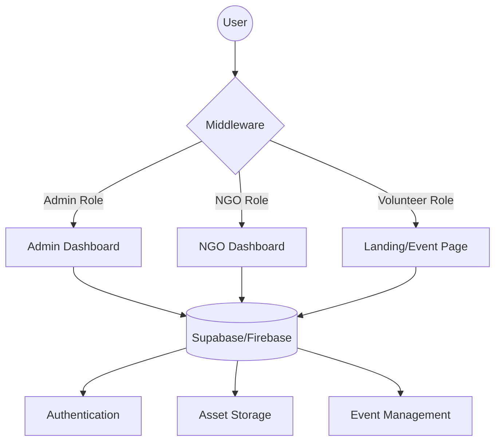

<div align="center">

# 🌐 Connect Platform

**Bridging the gap between NGOs and Volunteers through a seamless digital ecosystem.**

[](https://nextjs.org/)
[](https://www.typescriptlang.org/)
[](https://supabase.com/)
[](https://firebase.google.com/)
[](https://tailwindcss.com/)
[](https://www.framer.com/motion/)

</div>

---

## 📖 Description

**Connect Platform** is a comprehensive web application designed to facilitate the connection between Non-Governmental Organizations (NGOs) and passionate volunteers. The platform streamlines the process of event creation, volunteer recruitment, and administrative oversight through three distinct user perspectives: **Administrators**, **NGOs**, and **Volunteers**.

By leveraging a modern full-stack architecture, Connect provides a scalable environment where NGOs can publish opportunities and volunteers can find causes they care about, all while maintaining a secure and responsive user experience.

## 🗺️ Interactive Table of Contents

- [🚀 Key Features](#-key-features)
- [🛠️ Tech Stack](#️-tech-stack)
- [🏗️ Architecture](#️-architecture)
- [⚙️ Getting Started](#️-getting-started)
- [📂 Project Structure](#-project-structure)
- [🛡️ Security & Middleware](#️-security-&-middleware)
- [🤝 Contributing](#-contributing)
- [📄 License](#-license)

---

## 🚀 Key Features

| Role | Capabilities | Key Pages |
| :--- | :--- | :--- |
| **Admin** | Global oversight, user management, and platform auditing. | `/admin/dashboard`, `/admin/ngos`, `/admin/volunteers` |
| **NGO** | Event creation, volunteer tracking, and profile management. | `/ngo/dashboard`, `/ngo/events/new`, `/ngo/profile` |
| **Volunteer** | Discovery of events, registration, and impact tracking. | `/page.tsx` (Landing), `/register`, `/login` |

### 🌟 Core Highlights
- **Dynamic Event Management**: NGOs can create and manage volunteering events in real-time.
- **Dual-Backend Integration**: Hybrid usage of **Supabase** for database/storage and **Firebase** for specialized services.
- **Modern UI/UX**: Responsive design powered by Tailwind CSS with fluid animations via Framer Motion.
- **Theme Support**: Integrated dark/light mode for enhanced accessibility.
- **Role-Based Access**: Strict routing control via Next.js Middleware to ensure secure access to admin and NGO dashboards.

---

## 🛠️ Tech Stack

### Frontend
- **Framework**: Next.js 14 (App Router)
- **Language**: TypeScript
- **Styling**: Tailwind CSS
- **Animations**: Framer Motion
- **Icons**: Lucide React
- **UI Components**: Custom modular components with `clsx` and `tailwind-merge`

### Backend & Infrastructure
- **Database & Auth**: Supabase
- **Additional Services**: Firebase
- **State/Theme**: `next-themes`
- **Notifications**: `react-hot-toast`

---

## 🏗️ Architecture



---

## ⚙️ Getting Started

### Prerequisites
- Node.js 18.x or higher
- npm / yarn / pnpm
- A Supabase project account
- A Firebase project account

### Installation

1. **Clone the repository**
   ```bash
   git clone https://github.com/ajay1234-dev/connect-web.git
   cd connect-web
   ```

2. **Install dependencies**
   ```bash
   npm install
   ```

3. **Environment Setup**
   Create a `.env.local` file in the root directory and add your credentials:
   ```env
   NEXT_PUBLIC_SUPABASE_URL=your_supabase_url
   NEXT_PUBLIC_SUPABASE_ANON_KEY=your_supabase_key
   NEXT_PUBLIC_FIREBASE_API_KEY=your_firebase_key
   # Add other Firebase config variables as required by lib/firebase.ts
   ```

4. **Run the development server**
   ```bash
   npm run dev
   ```
   Open [http://localhost:3000](http://localhost:3000) to view the app.

---

## 📂 Project Structure

```text
connect-web/
├── app/
│   ├── (auth)/             # Login and Registration flows
│   ├── admin/              # Admin-only management panels
│   │   ├── dashboard/      # Global stats and overview
│   │   └── ngos/           # NGO verification and management
│   ├── ngo/                # NGO-specific workspace
│   │   ├── dashboard/      # NGO activity overview
│   │   └── events/         # Event creation and listing
│   ├── layout.tsx          # Root layout & ThemeProvider
│   └── page.tsx            # Public Landing Page
├── components/
│   ├── layout/             # Navbar, Footer
│   ├── sections/           # Hero, Features, Impact sections
│   └── ui/                 # Atomic UI components (ThemeToggle, etc.)
├── lib/
│   ├── firebase.ts         # Firebase initialization
│   ├── supabase.ts         # Supabase client configuration
│   └── utils.ts            # Helper functions (cn utility)
├── middleware.ts           # Route protection & Role-based access
└── tailwind.config.ts      # Design system configuration
```

---

## 🛡️ Security & Middleware

The application implements a `middleware.ts` layer to prevent unauthorized access. 

- **Route Guarding**: Any request to `/admin` or `/ngo` is intercepted to verify the user's session and role.
- **Redirects**: Unauthenticated users attempting to access protected routes are automatically redirected to the `/login` page.
- **Type Safety**: TypeScript is used throughout the application to ensure data integrity between the database and the UI.

---

## 🤝 Contributing

Contributions are welcome! Please follow these steps:

1. Fork the Project.
2. Create your Feature Branch (`git checkout -b feature/AmazingFeature`).
3. Commit your Changes (`git commit -m 'Add some AmazingFeature'`).
4. Push to the Branch (`git push origin feature/AmazingFeature`).
5. Open a Pull Request.

---

## 📄 License

This project is currently unlicensed. Please contact the maintainer for permission to use or modify the code.

<div align="center">
  <p>Built with ❤️ for social impact</p>
</div>
